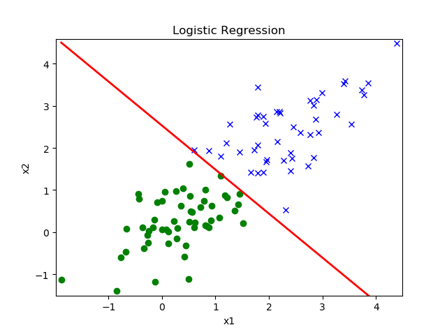
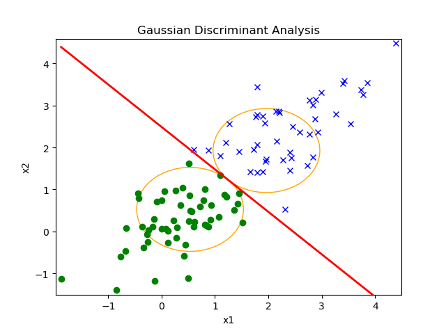
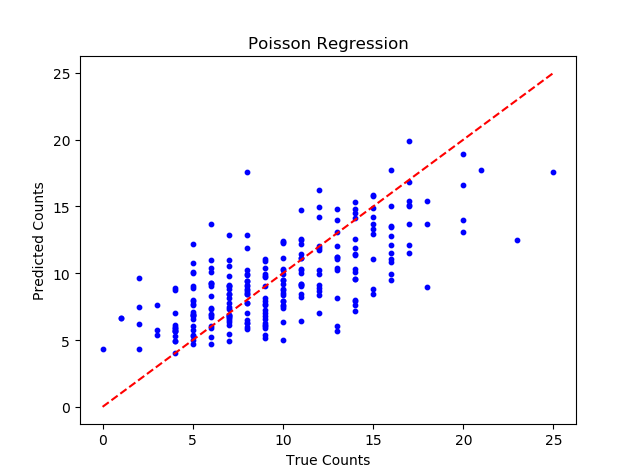
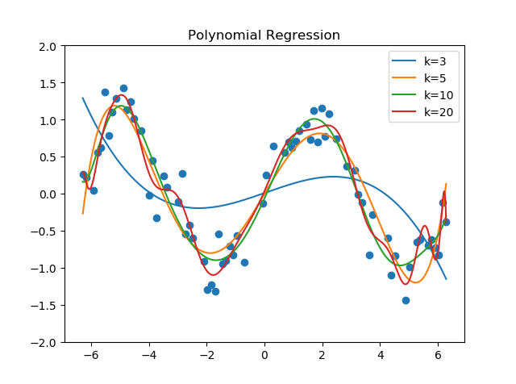
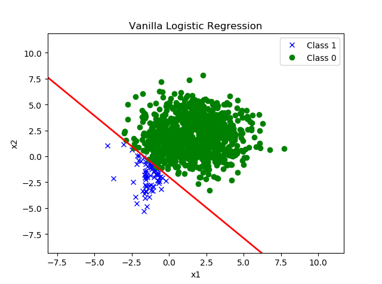
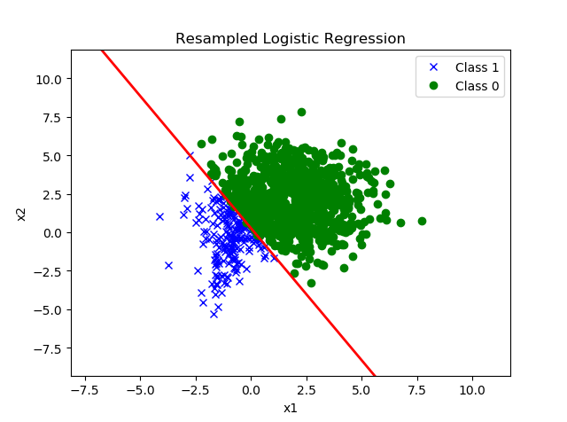
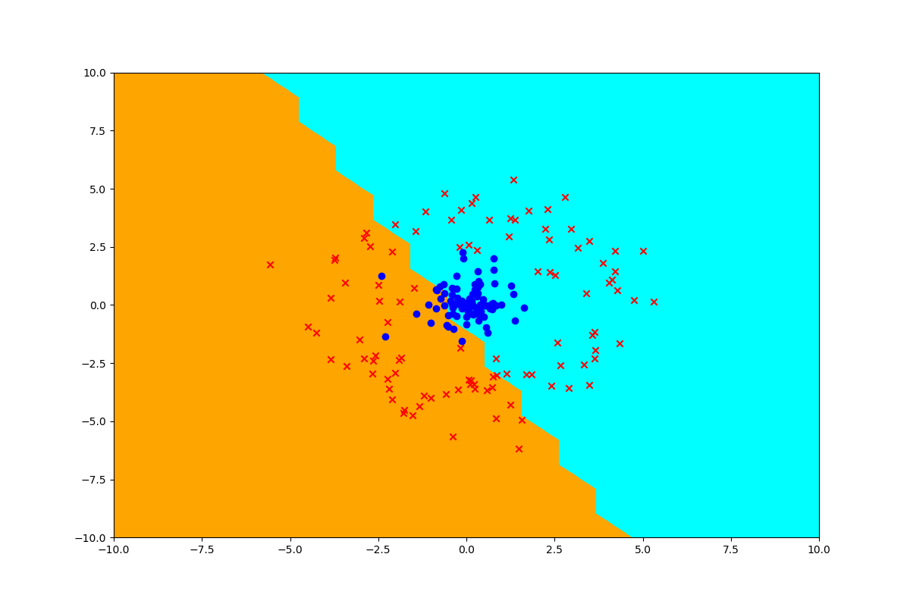
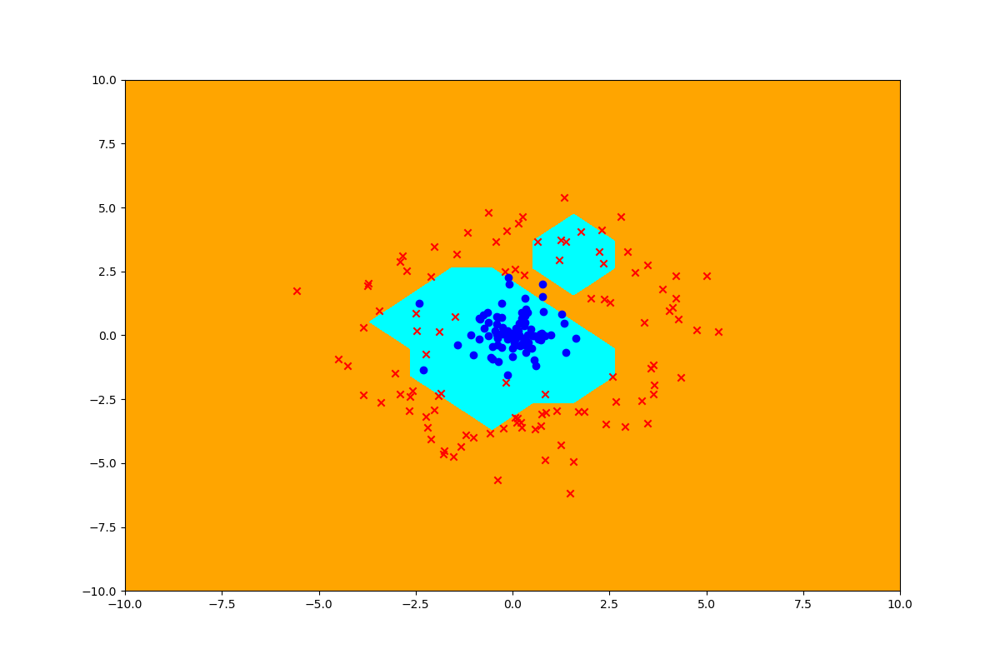
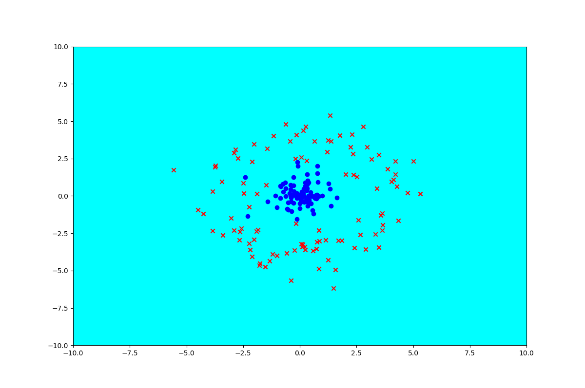
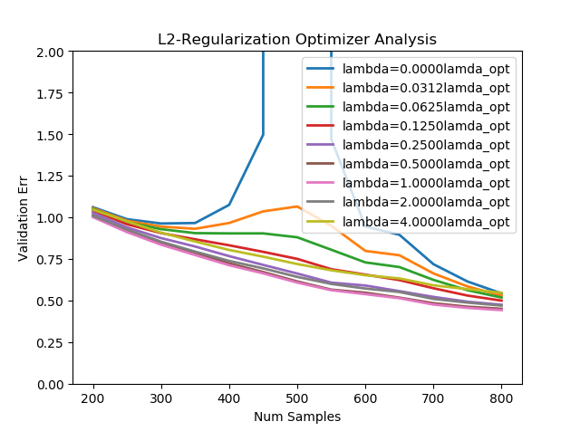

# MachineLearning
Compilation of Python code from machine learning course.

P-Set 1
--------
Linear Classifiers: logistic regression w/ Newton's method and gaussian
    discriminant analysis (GDA)\
     \
     \
Generalized Linear Models (GLMs): poission regression\
     \
Feature Maps: degree-n polynomial regression w/ and w/o sine transformation
    and overfitting analysis on small datasets\
     \
Imbalanced Dataset: vanilla logistic regression and resampled logistic regression
    performed on imbalanced dataset where the marginal distribution of the
    classes/labels are imbalanced (many more negative examples than positive
    examples), dataset resampled with simple reweighting technique to improve
    classifier accuracy on positive examples
     \
     \
                  
P-Set 2
--------
Naive Bayes and Support Vector Machines (SVMs): comparison in spam classifier
    accuracy between Naive Bayes (implemented with multinomial event model and
    Laplace smoothing) and SVM w/ RBF kernel\
Kernelized Perceptron: perceptron binary classification algorithm w/ stochastic
    gradient descent-like implementation, sign(x) hypothesis, and three kernels
    corresponding to different high-dimensional feature mappings (dot-product
    kernel, RBF kernel with radius 0.1, non PSD kernel used for analysis)\
     \
     \
     \
Bayesian Interpretation and Regularization: analysis of the double descent
    phenomenon in ridge regression with various values for lamba optimizer
     \
